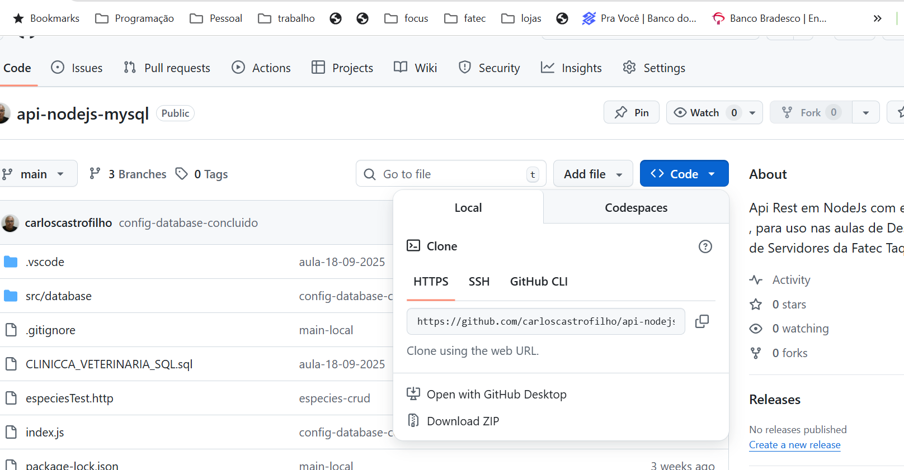
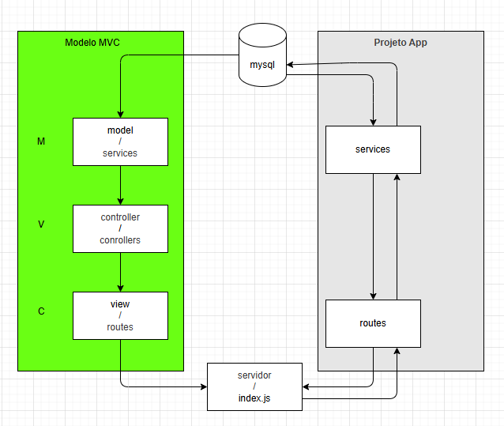

# Projeto modelo de uma Api simples em nodejs com acesso ao banco de dados mysql


Este projeto destina-se a  servir de modelo para estudantes iniciantes.


1. clone o projeto para seu computador local, observe na imagem que você deve clicar no botão **code** da pagina do projeto e logo em seguida em copiar para pegar o link do repositorio:



utilize o comando `git clone` no terminal de sua preferencia para fazer a clonagem do repositorio:


exemplo de codigo:
``` bash
git clone https://github.com/carloscastrofilho/api-nodejs-mysql.git
```

---

apos clonar o projeto no abra a pasta do projeto na sua IDE de desenvolviemnto ou no terminal
siga os passos abaixo:

a) mova o prompr do terminal para a pasta da clonagem do projeto, utilizando o comando de CLI **cd** espaco e o nome da pasta:

```bash
cd api-nodejs-mysql
```

b) faça a instalação das dependencias, utilizando o **npm** com o comando **install** sem parametros :

comando
```bash
npm install
```
c) para inicializar o projeto execute o script disponivel no package.json de nome **de**:

comando:
```bash
npm run dev
```

---
Estrurua organizacional do projeto:

🧱 Estrutura do Projeto (MVC) que estamos utilizando para o desenvolviemnto do nosso servidor backend.

```bash
app/
    ├── src/
        │
        ├── controllers/
        │   └── usersControllers.js
        ├── services/
        │   └── usersServices.js
        ├── routes/
        │   └── usersRoutes.js
        ├── database/
        │   └── config.js
        ├── tests/
        │   └── usersTests.http
        │
        ├── index.js
        ├── readme.md
        ├── .gitignore
        └── package.json
```

---

### Tabela comparativa 
* abaixo vemos a tabela compartiva entre o conceito CRUD para SQL ansy e para o padrão api-rest;

| CRUD    | SQL-ANSY | api-rest | end-point |ação
| --------|---------|---------|----|----
| create | insert | POST | `<endpoint>/` |Inserir/criar um novo registro end-point/tabela
| read | select | GET | `<endpoint>/` |recuperar/consultar os registros de um end-point/tabela
| update | update | PUT | `<endpoint>/:id` |alterar/modificar um registro de um end-point/tabela
| delete | delete | DELETE | `<endpoint>/:id` | apagar/excluir um registro de um end-point/tabela
| read | select | GET | `<endpoint>/:id` |recuperar/consulta um registro um end-point/tabela

---

### Fluxo de MVC

Diagrama atual do nosso projeto.



---
### Projeto para Prática e Estudos

Acesse explicações detalhada do projeto `clinicapest` [Guia de Completo](clinicapets/clinicapets.md)
